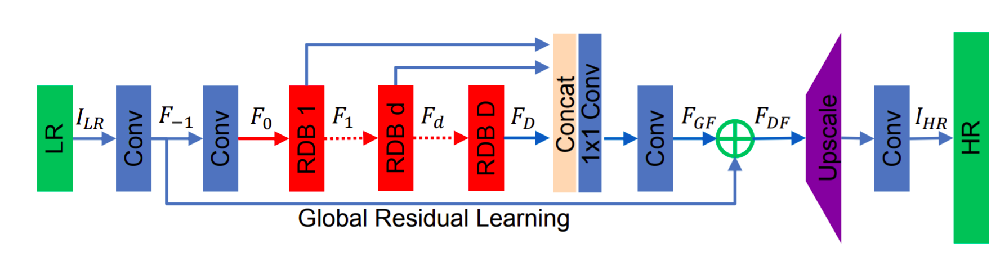

 # Ultra Sharp : Super Resolution With Residual Dense Network

 In this project, The architecture makes full use of hierarchial features from original low-resolution (LR) images to achieve higher performance. The network structure will consists of four main blocks. The core of the architecture is the residual dense block(RDB) where the local features are extracted and made use of via dense convolutional layers. In this work, investigation of each block was performed and effect of each modules was studied and analyzed. Analysis by various loss metrics were carried out in this project. Also a comparison was made with various state of the art models.The modules in the model were be built from scratch and were trained and tested. The training and testing was carried out for various scaling factors and the performance was evaluated. For more details, please checkout the [Report](ResidualDenseNerwork_Report.pdf) attached.

 **Architecture of Residual Dence Network,**

**Clone to local**
```
git clone https://github.com/karthickpgunasekaran/SuperResolutionWithRDN.git
```

**Usage:**
```
python controller.py --epochs 5 --do_train True --do_eval False --batch_size 12 --lr 1e-4 --scale 4 --source_dir "path-to-source-files" --target_dir "path-to-target-files" --output_dir "point-to-output-folder"

arguments: 
--epochs      - No of epochs the training should be taking place
--batch_size  - Size of each training batch
--lr          - Learning Rate
--do_train    - If training needs to be carried out
--do_eval     - If eval needs to be carried out
--scale       - Upsampling scale ratio
--source_dir  - Path to Low resolution images
--target_dir  - Path to high resolution images
--output_dir  - output folder to save the model and results
```

**Running in GPU bash script**

```
#!/bin/bash

$SOURCE_DIR="source_dir_path"
$TARGET_DIR="target_dir_path"
$OUTPUT_DIR="output_dir_path"

python controller.py --epochs 5 --batch_size 12  --do_train True --do_eval False --lr 1e-4 --scale 4 --source_dir $SOURCE_DIR --target_dir $TARGET_DIR --output_dir $OUTPUT_DIR 
```
